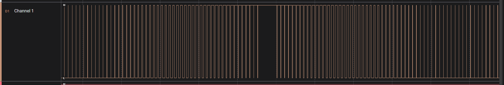

## Hardware
STM32F103C8T6 [Black Pill](https://stm32-base.org/boards/STM32F103C8T6-Black-Pill#User-LED)

## Connections
- LED on PA8 via 470R resistor to GND

## Config
- Clock 
    - External 8MHz
    - MUX - PLLCLK (x9)
    - HCLK = 72MHz
    - APB2 Prescaler = 2
    - So, APB2 timer clock = 72MHz
- Timer - Timer 1 (htim1)
    - Clock Source - Internal Clock
    - Channel 2 - PWM generation CH2
    - Prescaler - 720
    - Period - 1000
    - So, PWM Frequency = 72MHz/(720*1000) = 100Hz
    - DMA Settings
        - DMA Request TIM1_CH1
        - DMA1 Channel 2
        - Memory to Peripherals
        - Increment memory address Half word
        - Circular Mode

