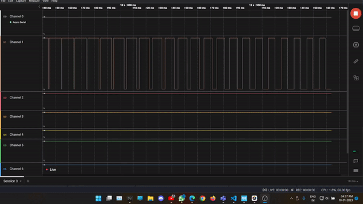

# STM 32 PWM Modes

## Introduction
Experimenting with various PWM modes on STM32F103C8T6.

## Contents
```
|_ Timer_Interrupt
|_ PWM_Timer1
|_ PWM_Analog_Slope
|_ PWM_DMA
```

1. [Timer Interrupt](./Timer_Interrupt/):
Using timer overflow interupt and toggling an LED with the Interrupt Service Routine.
<!--  -->

2. [PWM on Timer](./PWM_Timer1/):
Using PWM generation configuration on Timer. Setting Capture Compare Register for Duty Cycle and Auto Reload Register for Frequency.
<!--  -->

3. [Analog slope with PWM](./PWM_Analog_Slope/):
Programmatically changing the value in the Capture compare register from inside the `while(1){}` super loop with a small delay, to generate a slope in the filtered PWM signal.
<!--  -->

4. [DMA controlled PWM](./PWM_DMA/):
Feeding the values from an array containing a lookup table of different duty cycles through DMA transfer. This is advantageous because the CPU remains free throughout the transfer and the duty cycle is directly loaded from the memory to the CCR register via DMA.



<br>*[A very slow PWM with varying duty cycle]*